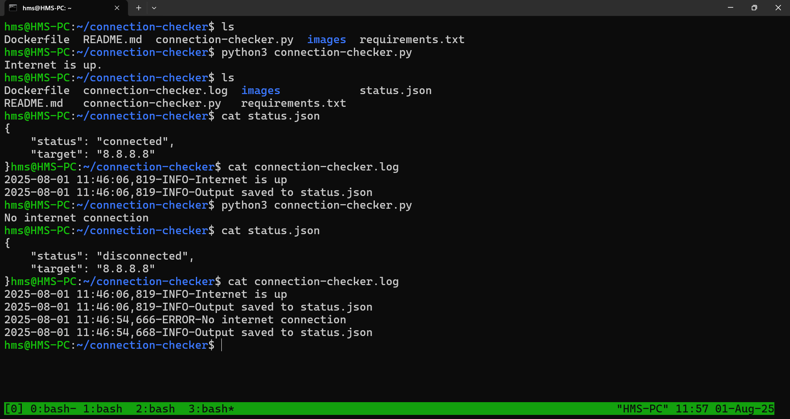

# Connection Checker

This is a Python tool to check internet connectivity on various devices including VMs, PCs, and containers.

The tool uses **ping requests** (ICMP packets) to test network connectivity. It generates logs, which are essential for cybersecurity and troubleshooting.

The tool has been Dockerized and is planned to be integrated into a CI/CD pipeline.

## Purpose

This tool helps users:

- Verify if their internet connection is active.
- Troubleshoot network issues on containers, VMs, and other environments.


## Requirements

- Python 3 must be installed to run the tool.
- The tool runs on a command-line interface (CLI).


## Dependencies

- Dependencies are listed in `requirements.txt` file.


## Usage

Run the tool from the command line as follows:

```bash

python3 connection-checker.py --target <ip_address_or_url> --packet <int> --output <json_file>
   ```
Where:

- --target <ip_address_or_url>: The IP address or URL to test connectivity against.

- --packet <int>: Number of ping packets to send during the test.

- --output <json_file>: Filename to save the output in JSON format.

To simplify, you can run the script with default arguments:

```bash

python3 connection-checker.py
   ```

## Screenshot

- Here is a screenshot of the tool in action, showing scenarios where the internet is on and when its off.

 


## Docker

- The tool is Dockerized for easy deployment and integration with CI/CD pipelines.

## Logging

- The tool produces logs that are helpful for cybersecurity analysis and troubleshooting network issues.

